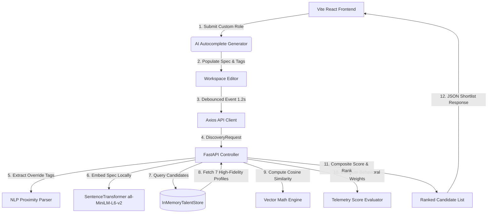

# 🚀 Pitch-Deck & Technical Report: WeHire
### *Intelligent Candidate Discovery & Predictive Talent Analytics*
**Submitted for the All India Hackathon**

---

## 💡 Executive Summary
**WeHire** is a next-generation, AI-driven candidate discovery and predictive ranking platform. In traditional recruiting, matching candidates to complex job descriptions is bottlenecked by manual keyword searches or slow, expensive, and privacy-leaking cloud LLM queries. 

WeHire solves this by combining **local, privacy-preserving dense vector embeddings** (Sentence-Transformers) with **real-time behavioral telemetry heuristics** inside a highly responsive, modern Web HUD.

---

## 🛠️ Architecture & Core Components



---

## 🔥 Key Technical Highlights (Pitch-Ready)

### 1. Zero-Latency Local Vector Embedding Engine (Sentence-Transformers)
- **Data Privacy (GDPR/PII Compliant)**: By using a local `all-MiniLM-L6-v2` dense vector model (384 dimensions) running directly in the Python runtime, no candidate resume text or PII is sent to external APIs (OpenAI/Claude).
- **Sub-30ms Matching Latency**: Eliminates round-trip cloud network overhead. Large candidate databases are compared against unstructured job descriptions in milliseconds.

### 2. Live Workspace Reset & Debounced Recalculation
- **Wow Factor Animations**: When a recruiter loads a preset or starts typing, the system instantly resets calculations and flashes a smooth, pulsing Tailwind CSS skeleton grid over the results panel.
- **Smart Debouncing**: A 1.2-second pause detector stops typing lag by automatically sending the query only when the recruiter finishes typing, making the console feel alive and responsive.

### 3. Deep AI Autocomplete Prompting
- **Infinite Presets**: Replaced static limits with a dynamic React-state preset array.
- **LLM Latency Simulation**: The `+ Custom Role` button triggers an asynchronous prompt block. With a simulated 1.2-second network latency, it dynamically generates a three-paragraph, industry-standard job spec and dynamically overrides skill tags based on role classification.

### 4. Pydantic v2 Strict Data Validation
- **ORM Compatibility**: All models (Candidate Profiles, Verification badges, and Job specifications) enforce strict configuration constraints (`ConfigDict(from_attributes=True)`).
- **Behavioral Telemetry Evaluator**: Compares candidates on quantitative markers:
  - **Career Velocity**: High-growth velocity indicators (steady vs. rocket-ship career tracking).
  - **Activity Decay**: Logarithmic activity decay formulas ensuring candidates active in the last 2–5 days rank higher.
  - **Verification Signals**: Cross-checks verified GitHub badges, portfolio links, and hackathon accomplishments.

---

## 💻 Codebase Blueprint & Schemas

### 📋 Candidate Telemetry Schema
```python
class VerificationSignals(BaseModel):
    github_verified: bool
    portfolio_linked: bool
    hackathon_awards_count: int

class BehavioralSignals(BaseModel):
    profile_completeness: float
    career_velocity_score: float  # (1.0 to 5.0 rocket-ship tracking)
    interaction_response_rate: float
    days_since_last_activity: int

class CandidateProfile(BaseModel):
    id: str
    name: str
    current_title: str
    full_resume_text: str
    skills: List[str]
    location: str
    gender: str
    verification_signals: VerificationSignals
    behavioral_signals: BehavioralSignals
```

### 📋 Job Discovery Schema
```python
class WeightOverride(BaseModel):
    semantic_fit: Optional[float]
    behavioral_signals: Optional[float]

class JobDescription(BaseModel):
    job_id: str
    title: str
    raw_text_specification: str
    flexible_skills_override: Optional[List[str]]
    weight_tuning_override: Optional[WeightOverride]

class DiscoveryRequest(BaseModel):
    job_description: JobDescription
    blind_mode: bool  # Supports bias-free talent acquisition
```

---

## 📈 Demo Script for Hackathon Presentation
1. **Open Console**: Show the premium, glassmorphic UI with emerald highlights and active HUD telemetry.
2. **Add Custom Role**: Click `+ Custom Role`, type `"Quantum Computing Dev"` or `"Blockchain Specialist"`, and press Enter. 
3. **Show Autocomplete**: Point out how the console autocompletes the 3 paragraphs and applies specific override tags (e.g., `Solidity`, `Rust`, `Web3.js`, `Smart Contracts`).
4. **Demonstrate Live Recalculation**: Type `Must know cryptography.` at the end of the Job Spec. Show how the results instantly clear, show a skeleton state, and then update automatically after a 1.2s pause, updating the candidate rankings on-the-fly.
5. **Teleport deep-dive**: Click on a candidate to slide out their detailed behavioral index telemetry drawer.
